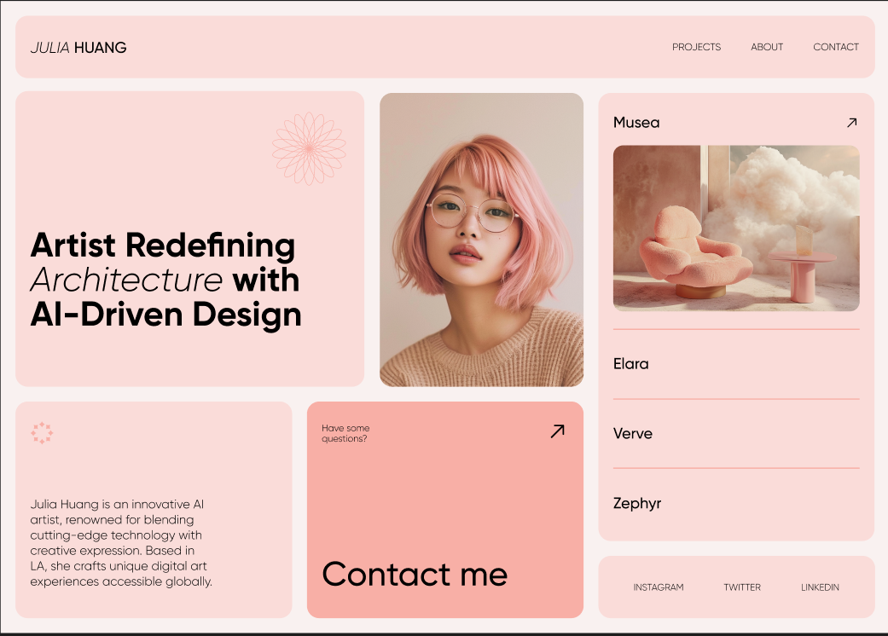

# Reto de Maquetación: Recreando el Diseño de Figma con HTML y CSS Puro

¡Bienvenidos, coders! En este desafío, pondremos a prueba nuestras habilidades de maquetación con HTML y CSS, recreando un diseño web moderno y minimalista. El objetivo es lograr la mayor fidelidad posible al diseño propuesto, utilizando únicamente las herramientas fundamentales de la web.

## El Desafío

Tu tarea es replicar visualmente el siguiente diseño de Figma utilizando **solo HTML y CSS**. Esto significa **prohibido el uso de librerías, frameworks o preprocesadores CSS** (ej. Bootstrap, Tailwind, React, Sass, etc.).

**Diseño a replicar:**

[\[Diseño de Figma\]](https://www.figma.com/design/INei8l9C8s4KgZNIlZMAZN/Bentolio-%7C-Portfolio-Design-Template--Community-?node-id=0-3&t=ledpd06xsBbaLFuC-1)

**Captura de Pantalla del Diseño:**



## Requisitos Clave

Para considerar el ejercicio completado con éxito, tu maquetación debe cumplir con los siguientes puntos:

1.  **Fidelidad Visual:** El diseño final debe ser lo más parecido posible al diseño original en términos de layout, espaciado, tipografía, colores e imágenes.
2.  **HTML Semántico:** Utiliza las etiquetas HTML adecuadas para estructurar el contenido de manera semántica y accesible (ej. `<header>`, `<nav>`, `<section>`, `<footer>`, etc.).
3.  **CSS Puro:** Todo el estilo debe ser implementado con CSS vanilla.
4.  **Uso de Assets:** Deberás extraer y utilizar todos los assets visuales (imágenes, iconos, etc.) y los colores exactos presentes en el diseño.
5.  **Navegación Interactiva:**
    * Los enlaces del `navbar` (`PROJECTS`, `ABOUT`, `CONTACT`) deben ser funcionales:
        * `CONTACT`: Debe llevar a tu cuenta de WhatsApp, Telegram o perfil de Discord (elige uno).
        * `PROJECTS`: Debe llevar a tu perfil de Github.
        * `ABOUT`: Puede ser un `link` `#` vacío o llevar a otra sección de la misma página si implementas un scroll suave.
    * Los enlaces de redes sociales (`INSTAGRAM`, `TWITTER`, `LINKEDIN`) en el pie de página (o sección inferior) pueden llevar a `link` `#` vacíos.

## Consejos para el Éxito

* **Inspecciona el Diseño:** Tómate tu tiempo para analizar el diseño de Figma. Identifica los bloques, las secciones y cómo están organizados.
* **Divide y Vencerás:** Aborda el diseño por secciones (ej. cabecera, sección principal, tarjetas, pie de página).
* **Caja Modelo (Box Model):** Presta mucha atención al `box model` (margin, padding, border) para lograr el espaciado correcto.
* **Flexbox y Grid:** ¡Son tus mejores amigos para el layout! Utilízalos para alinear elementos y crear diseños complejos de manera eficiente.
* **Nombrado de Clases:** Usa nombres de clases descriptivos y significativos para tus elementos HTML y CSS.
* **Organización CSS:** Mantén tu CSS organizado. Puedes usar comentarios para delimitar secciones o un enfoque BEM si te sientes cómodo.
* **Prueba en Diferentes Navegadores:** Aunque no es un requisito estricto, es una buena práctica probar tu maquetación en diferentes navegadores.


## Puntos de Bonus

- Implementación de animaciones sutiles
- Diseño responsive avanzado
- Deploy en hosting (Netlify, GitHub Pages, Firebase, etc.)

## Estructura de Proyecto Recomendada

```
figma-maquetation-challenge/
├── src/
│   ├── index.html
│   └── styles.css
├── assets/
│   ├── images/
│   └── fonts/
└── README.md
```

## ¡Manos a la Obra!

Este ejercicio te permitirá consolidar tus conocimientos de HTML y CSS de una manera práctica y divertida.

---

¡Buena suerte, coders!